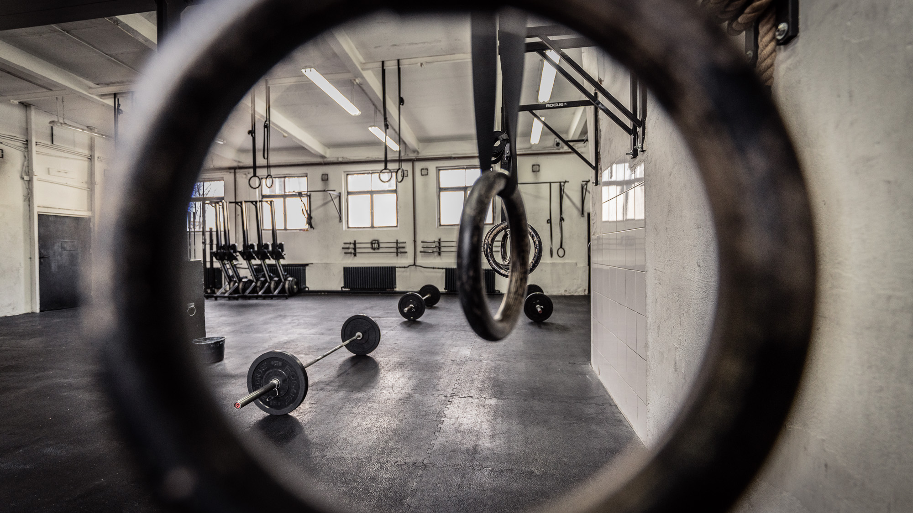

# project-crossfit-data
Data-Driven Insights from CrossFit Competition

This repository was created in the course of my final project in neuefische Data Science Bootcamp.

### CrossFit

CrossFit incorporates elements of olympic weightlifting, gymnastics, high-intensity intervall training and many more. There is a wide range equipment used, like barbells, kettlebells, rowing machines, jump ropes, pull-up bars, plyo boxes etc. A typical workout in CrossFit (called Workout of the Day - "WOD") is a bootcamp-like circuit training. The goal is to perform repetitions of various exercises with maximum weight as fast as you can. The annual CrossFit Open is a five-week-long international competition with one workout each week. Everybody in the world can participate and the amount of competitors is still growing, e.g. around 350k in 2019.

I really like it, because it is versatile, measurable and you can track all your improvements.

### Dataset

The project deals with data from Reebok Crossfit Open 2019 and contains already provided Open Athlete's and Open Score datasets from [kaggle.com](https://www.kaggle.com/jeanmidev/crossfit-games) as well as self-employed benchmark statistics from [crossfit.com](https://games.crossfit.com) via webscraping:
* Athlete's statistics like height, weight, age, country of origin, etc.
* Open workout results like time or repetitions of each competition
* Athlete's benchmark statistics like 1RM (maximum weight of one repetition) of olympic lifts, best scores of specific benchmark workouts or personal records in bodyweight exercises

### Purpose of Data-driven Insights

Possible insights from competition data could help:
* both CrossFit beginners and elite athletes to evaluate their own performance
* Coaches to give reasonable advice
* Organizers to improve their events

### Guiding Questions

In this project I am oriented towards following questions/tasks:
* Are the workouts in the CrossFit Open 2019 well-balanced regarding gender and/or level of performance?
* Which exercises are weak points in competitor's performance?
* What has the most significant impact on my ranking?
* Is it possible to predict workout scores? - Classifying the ability to perform or not perform:
  - one strict Handstand Push-Up
  - one Bar Muscle-Up

### File Content:
* in the [Notebook](https://github.com/malefiz1988/project-crossfit-data/blob/detailed_work/open_19_raw_data_description.ipynb) the description of the raw datasets from kaggle is done
* [Script](https://github.com/malefiz1988/project-crossfit-data/blob/detailed_work/data_mining_bs.py) is scraping benchmark statistics from the official CrossFit website
* [Notebook](https://github.com/malefiz1988/project-crossfit-data/blob/detailed_work/open_19_bs_cleaning.ipynb) documents the cleaning process of the scraped benchmark data and the [Script](https://github.com/malefiz1988/project-crossfit-data/blob/detailed_work/data_cleaning_bs.py) performs it
* [Notebook](https://github.com/malefiz1988/project-crossfit-data/blob/detailed_work/open_19_cleaning.ipynb) documents the cleaning process of the provided datasets (+ combines them) and the [Script](https://github.com/malefiz1988/project-crossfit-data/blob/detailed_work/cleaning_open_19.py) performs it
* a well documented EDA-Notebook is still in progress
